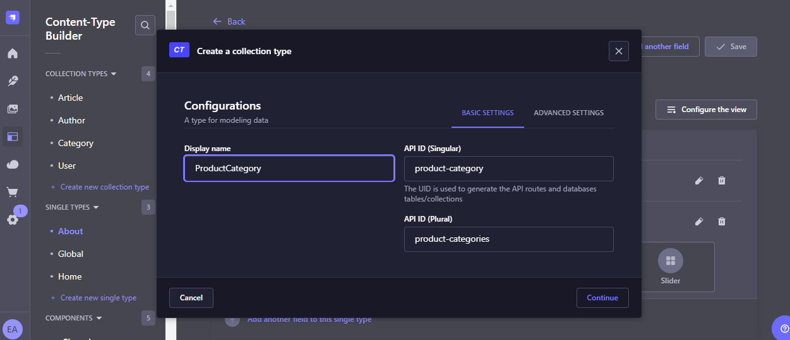

 Start Strapi in watch mode. (Changes in Strapi project files will trigger a server restart)
         ```bash
          npm run develop

          Start Strapi without watch mode.
          npm run start

          Build Strapi admin panel.
          npm run build

          Deploy Strapi project.
          npm run deploy

          Seed your database with sample data.
          npm run seed:example

          Display all available commands.
          npm run strapi

          To get started run

          cd C:\Users\eduar\Desktop\git-projects\strapi\backend
          npm run develop
          ```

          Account : epsiweb.developers@gmail.com       
          Password: same

Al crear las colecciones, siempre lo hacemos en singular.



# Strapi Interfaz

Content Type Builder: En esta sección creamos los diferentos tipos de componentes (o colecciones) que queremos que se renderizen.

Content Manager: En esta sección modificamos esos diferentes componentes segun cual seleccionemos.

Para la localización, solo le tenemos que pasar el siguiente valor al parametro de la URL.

"locale=es" --> En este caso, seleccionamos el idioma "Español".

NOTA: Primero tenemos que configurar la LOCALIZACION en el **next.config.ts**.